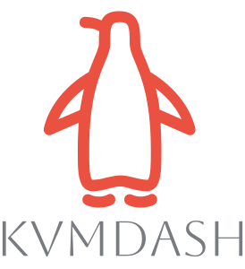

# Project Description: KVMDash

<table style="border-collapse: collapse; width: 100%;">
    <tr>
        <td style="width: 150px; padding: 10px; vertical-align: middle;">
            
        </td>
        <td style="padding: 10px; vertical-align: middle;">
            KVMDash is a web application that enables the management of Virtual Machines (VMs) on Linux systems.
            With a user-friendly interface, KVMDash facilitates the administration and monitoring of virtualization environments.
        </td>
    </tr>
</table>

## Demo Video

https://github.com/user-attachments/assets/ec76e8fa-f9b1-487d-87a8-6d370dbfb73c

## Features

### VM Management
- Create, delete, and configure VMs and containers through the web interface.
- Use templates for quick and standardized creation of VMs.

### System Monitoring
- Real-time monitoring of resources such as CPU, memory, disk usage, and other important system metrics.
- Clear visualization of system performance for optimal control and error analysis.

## Additional Documentation

- [Backend Documentation](https://github.com/KvmDash/KvmDash.back/blob/main/README.md)
- [Frontend Documentation](https://github.com/KvmDash/KvmDash.front/blob/main/README.md)

## TurnKey Linux Compatibility

KVMDash works seamlessly with [TurnKey Linux](http://mirror.turnkeylinux.org/turnkeylinux/images/iso/) images. With TurnKey Linux, you get access to over 100 pre-built, ready-to-use server appliances based on Debian.

### Integration Benefits:
- **Rapid Deployment:** Immediately ready-to-use specialized servers without complex configuration.
- **Wide Range:** From web server stacks (LAMP, LEMP) to CMS (WordPress, Drupal) and collaboration tools.
- **Security:** Regularly updated, hardened images with automatic security updates.

### Using TurnKey Images in KVMDash:
1. Download the desired TurnKey image from the official website.
2. Import the image into KVMDash as a VM template.
3. Create new VMs based on these templates with just a few clicks.

TurnKey images provide an ideal complement to KVMDash for quickly deploying productive server environments without having to perform complex manual configurations.
